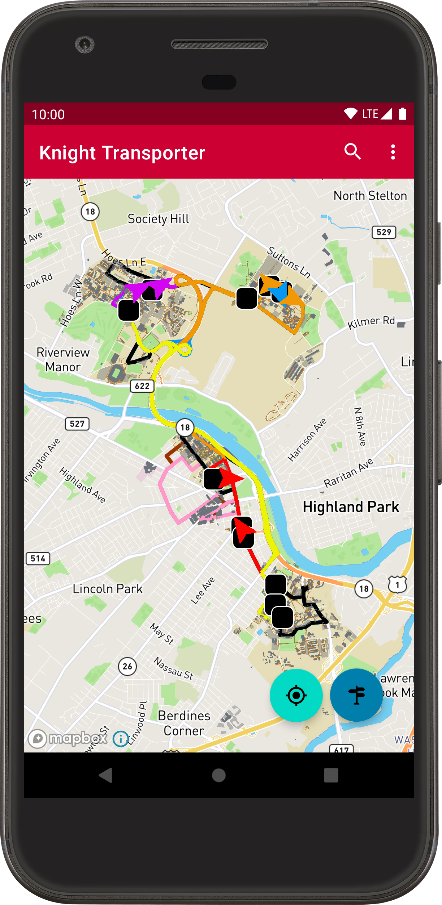
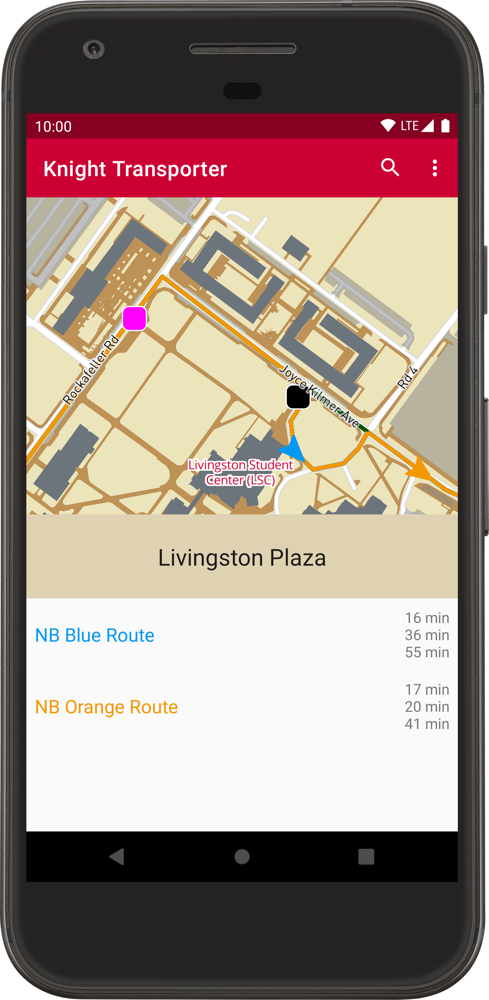
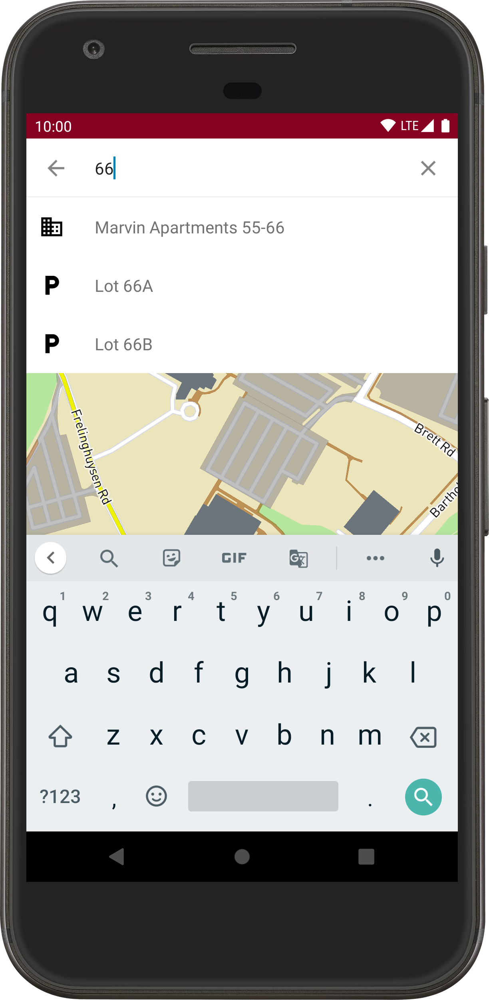
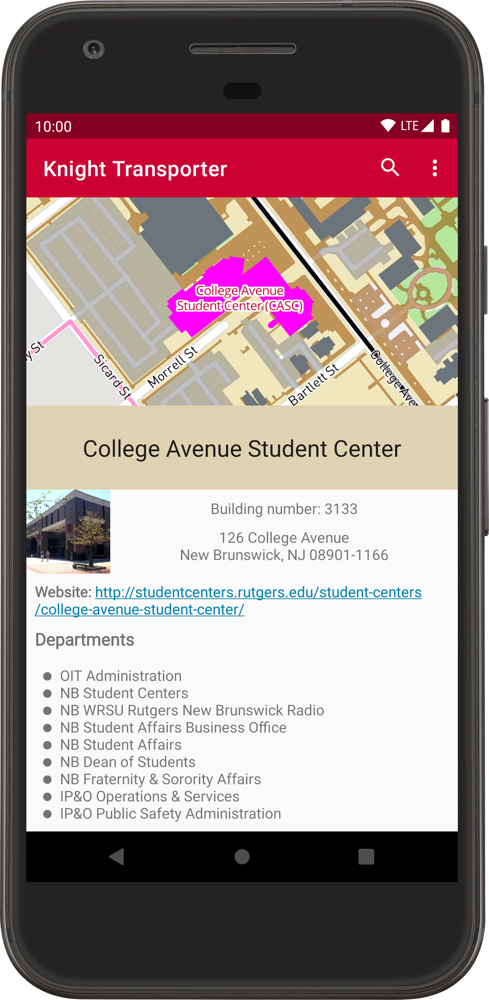

# Knight Transporter (Android version)

This is a Rutgers bus-tracking and map app.

It aims to combine features that currently exist in two separate applications:
- [TransLoc Rider](https://translocrider.com)*
  - displaying current bus locations on a map
  - displaying bus routes on a map
  - displaying arrival estimates
- <https://maps.rutgers.edu>*
  - displaying Rutgers-affiliated buildings, parking lots, and walkways on a map
  - allowing the user to search for Rutgers-affiliated buildings and parking lots
  - displaying details for these buildings and parking lots (such as address, photo, list of associated departments, etc.)

###### *Knight Transporter is unaffiliated with these other projects.

## Screenshots

Keep in mind that the app's UI may change significantly before release.

| New Brunswick campus | Stops | Search | Building details |
|:-:|:-:|:-:|:-:|
 |  |  |  |

## Building and running

1. [Obtain a Mapbox token](https://account.mapbox.com/access-tokens/create).
2. Add a string named `mapboxToken` containing this token to the package `edu.rutgers.knighttransporter`. I'd suggest placing it in `app/src/main/java/edu/rutgers/knighttransporter/Keys.kt`, since I've listed that file in `.gitignore`.
3. Run the bus server: <https://github.com/mileskrell/rutgersql>.
4. Add a string named `busServerUrl` containing the URL for the bus Socket.IO server to the package `edu.rutgers.knighttransporter`. For now, I'd suggest placing it in `Keys.kt` as well so it doesn't get checked in for no reason. Once we have this running on a dedicated remote server, then we can store the URL in a not-gitignored file.
5. I've encountered a [graphical issue](https://github.com/mapbox/mapbox-gl-native/issues/10829) with Mapbox on emulators (some map elements appear solid black), so I suggest running the app on a physical device.
